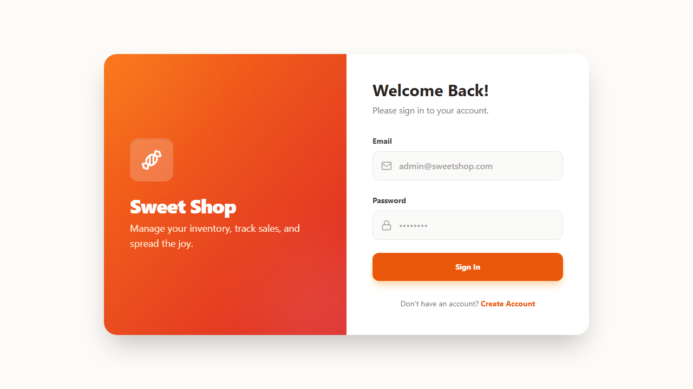
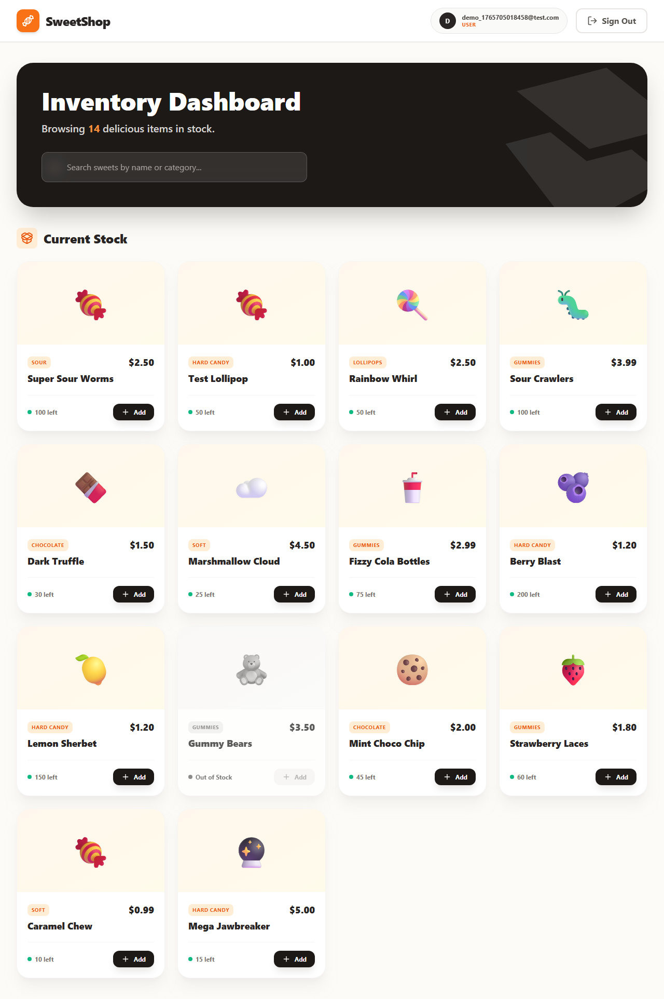
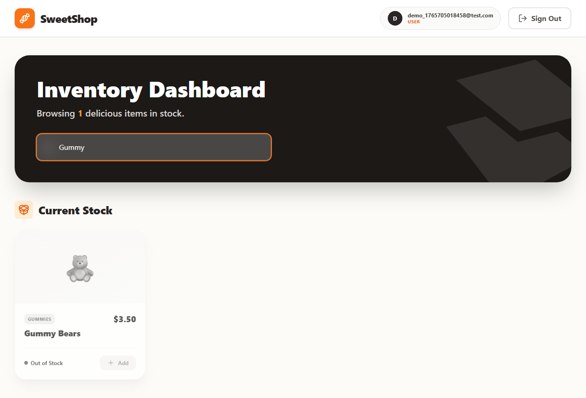
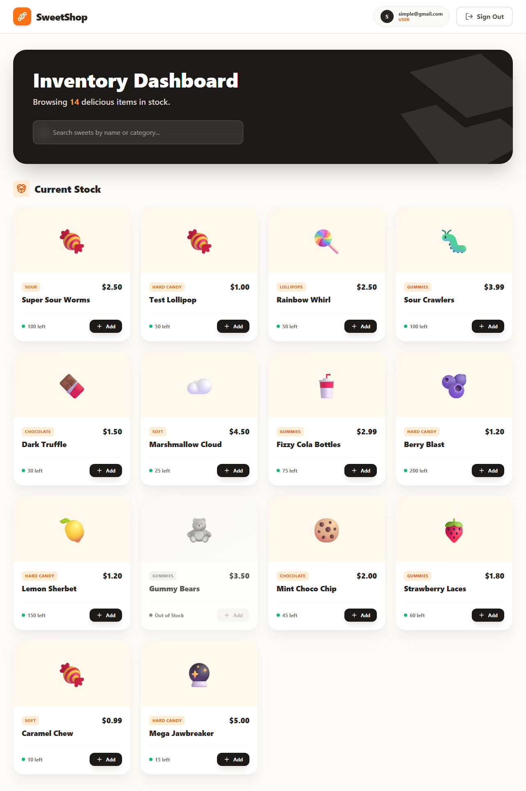
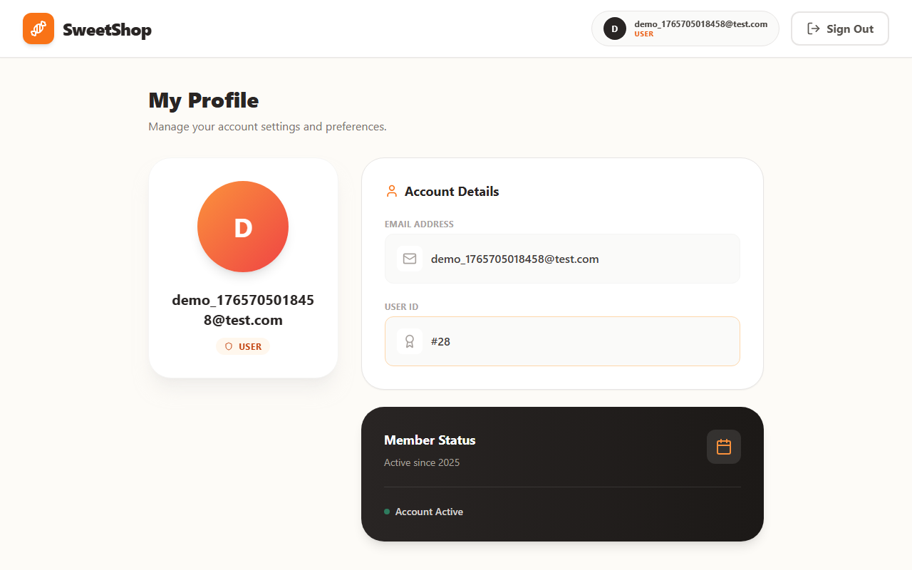

🍭 Sweet Shop Management System

A full-stack, strictly typed inventory management system for a boutique sweet shop. Featuring secure role-based auth, atomic inventory transactions, and a "warm," mobile-first design.

📖 Table of Contents

✨ Features

📸 Screenshots

🛠️ Tech Stack

🚀 Getting Started

🧪 Testing (TDD)

🤖 AI Usage Disclosure

✨ Features

🔐 Security & Auth

JWT Authentication: Secure stateless session management.

Role-Based Access Control (RBAC): * User: Browse catalog, filter items, add to cart, purchase.

Admin: Full CRUD operations on inventory, view analytics.

📦 Inventory Engine

Atomic Transactions: Uses Prisma transactions to prevent race conditions (e.g., two users buying the last donut simultaneously).

Real-time Tracking: Visual cues for Low Stock (<5 items) and Out of Stock.

Search & Filter: Instant client-side filtering by name, category, and price range.

🎨 User Experience

Responsive Design: Mobile-first approach using Tailwind CSS.

Performance: Vite-powered frontend for instant load times.

Feedback: Toast notifications for success/error states.

📸 Screenshots

Login & Auth

User Dashboard

Search Interface

Admin Inventory

Mobile Responsive View

User Profile

🛠️ Tech Stack

Domain

Technologies

Backend

Node.js, Express, TypeScript, BCrypt, JSONWebToken

Database

SQLite (Dev), Prisma ORM

Frontend

React (v18), Vite, Tailwind CSS, Lucide React, Axios

Testing

Jest (Backend Logic), Supertest (API Integration)

DevOps

ESLint, Prettier, Concurrently

🚀 Getting Started

Prerequisites

Node.js (v18+)

npm

1. Clone the Repository

git clone [https://github.com/yourusername/sweet-shop-system.git](https://github.com/yourusername/sweet-shop-system.git)
cd sweet-shop-system

2. Backend Setup

The backend runs on http://localhost:3000.

cd sweet-shop-backend

# Install dependencies
npm install

# Create Environment File
echo "PORT=3000" >> .env
echo "DATABASE_URL='file:./dev.db'" >> .env
echo "JWT_SECRET='super-secret-key'" >> .env

# Initialize Database & Run Migrations
npx prisma migrate dev --name init

# Seed Data (Demo sweets & admin user)
npx ts-node prisma/seed.ts

# Start Server
npm run dev

3. Frontend Setup

The frontend runs on http://localhost:5173.

# In a new terminal
cd sweet-shop-frontend

# Install dependencies
npm install

# Start Development Server
npm run dev

Note: The frontend is configured to proxy requests to http://localhost:3000 to avoid CORS issues during development.

🧪 Testing & Quality Assurance

This project strictly follows Test-Driven Development (TDD) principles. Tests were written before the implementation code.

Running the Test Suite

cd sweet-shop-backend
npm test

Current Status: 🟢 15/15 Passing

✅ Auth Middleware (Token validation)

✅ Inventory Logic (Atomic decrements)

✅ Route Integration

🤖 AI Usage Disclosure

In compliance with the assignment's AI Policy, I transparently document my collaboration with AI tools below.

🛠️ Tools Used

GitHub Copilot / Gemini: Used as a pair programmer for boilerplate generation, refactoring, and debugging.

Playwright: Used to automate the capture of high-quality screenshots for documentation.

📝 Specific Implementation Details

Area

Usage Description

TDD Workflow

I used AI to generate the "Red" (failing) test cases based on my requirements before writing the implementation. This ensured I adhered to strict TDD without getting bogged down in Jest syntax.

Design System

AI generated the initial Tailwind tailwind.config.js theme extension (colors: orange-500, stone-50) to ensure a cohesive "Warm" palette.

Debugging

AI helped resolve a specific version mismatch with Tailwind v4, suggesting a downgrade to v3 stable for better compatibility with existing plugins.

🧠 Reflection

AI significantly accelerated the setup phase (scaffolding the Monorepo) and styling. However, core business logic—specifically the atomic decrement for inventory and permission middleware—was written and verified manually to ensure security and correctness.

Made with 🍭 and TypeScript

